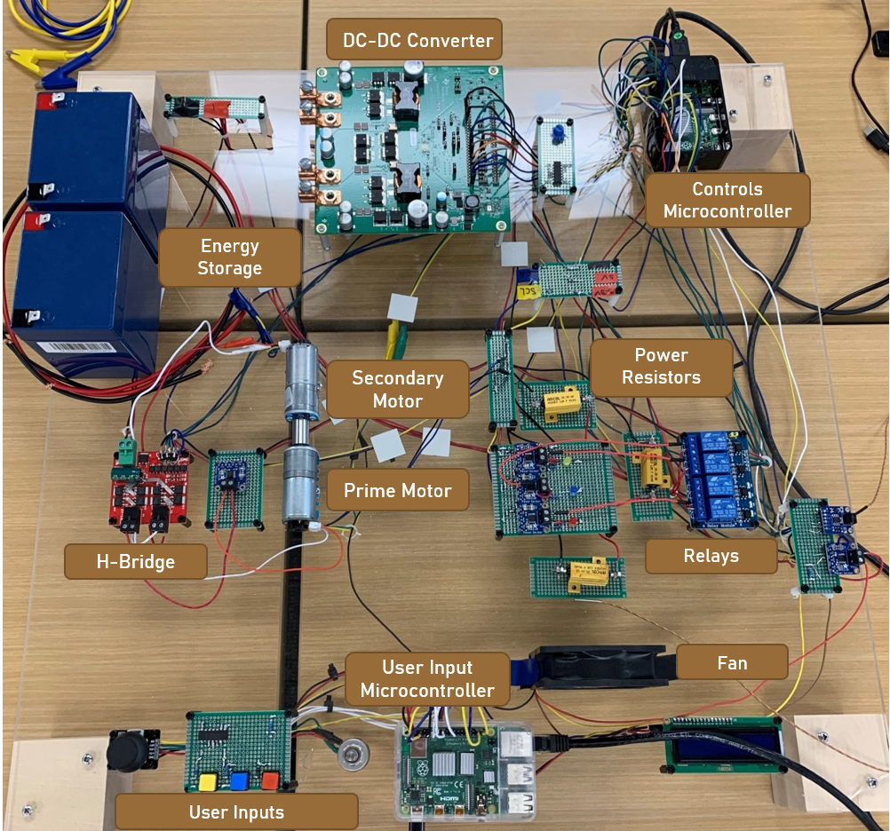
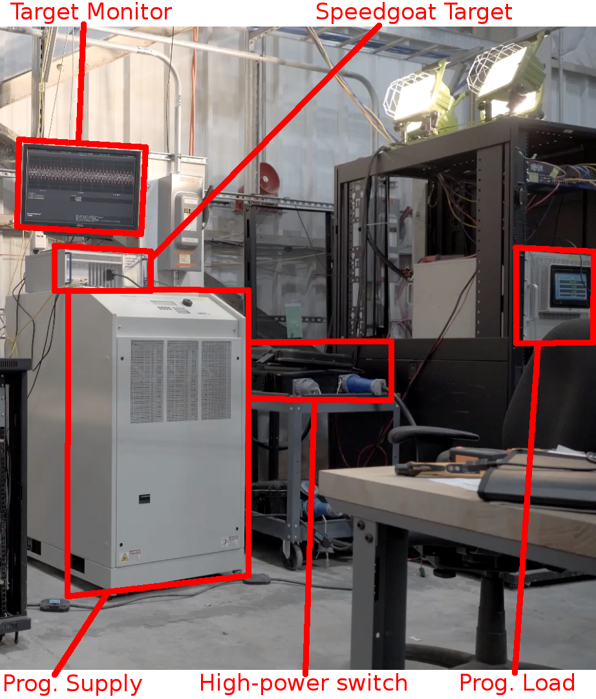
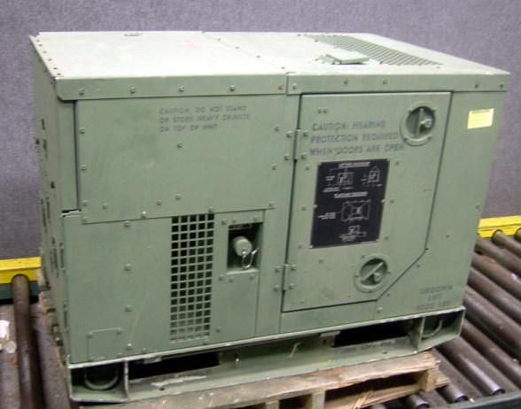
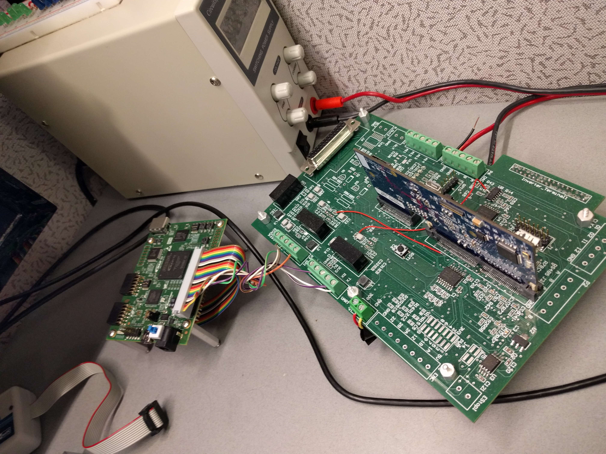
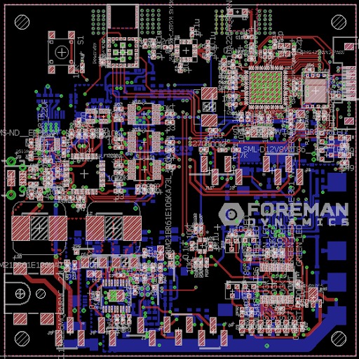
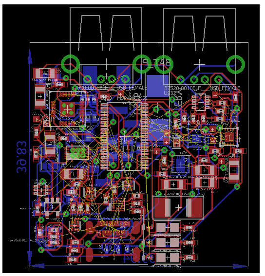
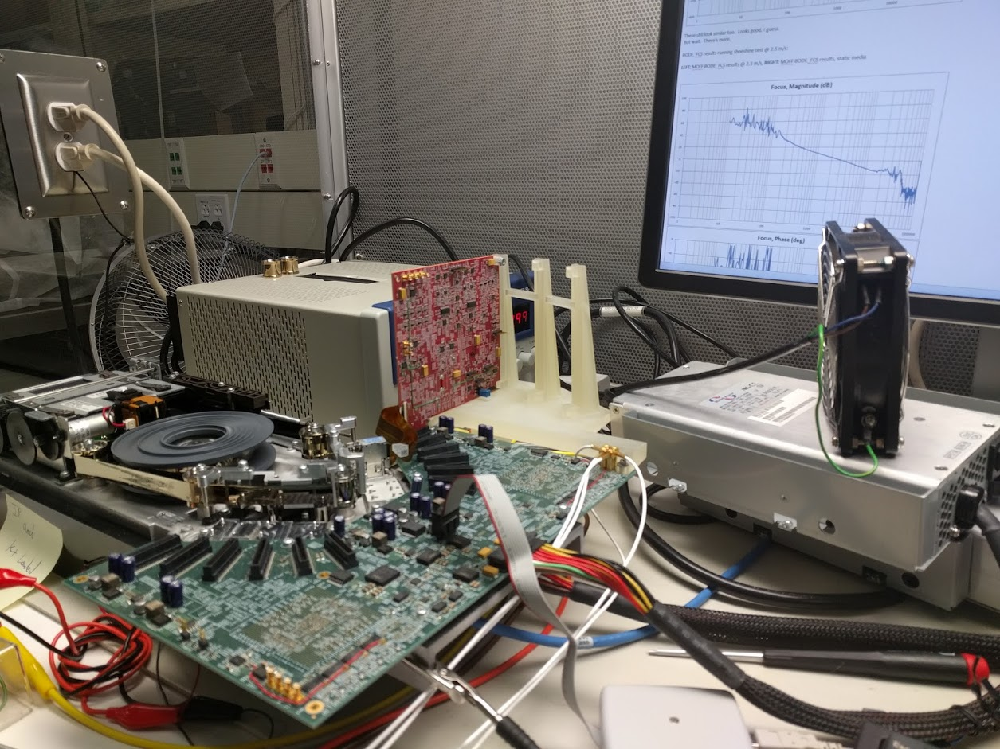

# Hardware Gallery
---

  
## Electrical Desktop Demonstrator (EDD) as a desktop-scale model of a Naval Shipboard Power System

  
## Motor-Generator Load

  
## Programmable Dynamic Constant Power Load (Electronic)

  
## Cummins 5 kW Tactical Quiet Generator (TQG)

  
## Hardware-in-the-Loop (HiL) Real-Time Simulation Set-Up

  
## Battery-powered sensor board

  
## Untethered power bank, charging mobile devices

  
## Optical Tape Drive Prototype 

[Home](./)
